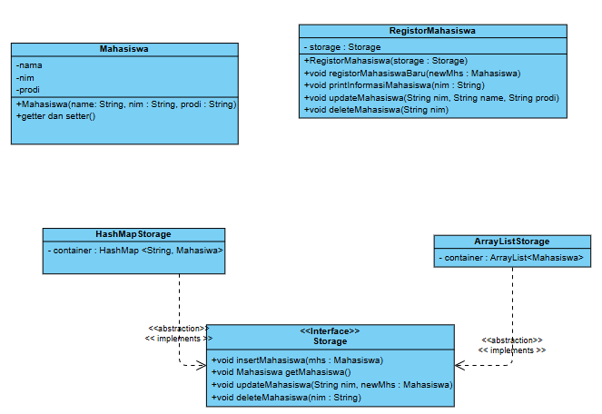

# UG 5 Inheritance dan Polymorphism


## PENJELASAN

### Mahasiswa
buat aja sesuai dengan diagram. Cuma getter setter dan constructor.

### Interface Storage
Interface ini untuk sistem penyimpanan Mahasiswa. Method bisa dilihat di class diagram.
- __void insertMahasiswa(Mahasiswa mhs)__

Memasukkan mahasiswa ke dalam container.
- __Mahasiswa getMahasiswa(String nim)__

Mengambil mahasiswa dengan NIM yang diberikan. return null kalau tidak ketemu.
- __void updateMahasiswa(String nim, Mahasiswa mhs)__

update mahasiswa dari storage.
- __void deleteMahasiswa(String nim)__

hapus mahasiswa sesuai NIM.
### ArrayListStorage
Implementasikanlah interface Storage dengan menggunakan ArrayList sebagai container datanya!

### HashMapStorage
Implementasikanlah interface Storage dengan menggunakan HashMap sebagai container datanya! Kunci HashMapnya adalah NIM dan valuenya object Mahasiswa

### RegistorMahasiswa
Kelas ini mempunyai properti bernama __storage__ yang merupakan sebuah objek implementasi __interface Storage__. dengan memanfaatkan properti __storage__, maka:
- __public void registerMahasiswaBaru(Mahasiswa newMhs)__

method ini mendaftarkan mahasiswa baru ke dalam __storage__. Tampilkan pesan berhasil kalau bisa. Tidak boleh memasukkan mahasiswa baru dengan NIM yang sama dengan data sebelumnya. Jika ada yang seperti itu, batalkan operasi ini dan tampilkan pesan gagal.
- __public void printInformasiMahasiswa(String nim)__

method ini menerima NIM berupa String, kemudian akan mencari mahasiswa dengan NIM tersebut di dalam __storage__. Kemudian, Mengeprint NIM, nama dan prodi ke layar. Jika NIM tidak ada di __storage__, tampilkan pesan gagal.
- __public void updateMahasiswa(String nim, String name, String prodi)__

Method ini menerima 3 parameter. Parameter NIM digunakan untuk mencari data mahasiswa yang mau diedit datanya. Kemudian, setelah selesai diedit, tampilkan pesan berhasil. Perhatikan jika mahasiswa tidak ditemukan.
- __public void deleteMahasiswa(String nim)__

Method ini mengahpus mahasiswa dengan NIM yang diberikan. Perhatikan jika mahasiswa tidak ada.


## OUTPUT
```
=== TES INSERT dan DUPLIKASI ===
Berhasil mendaftarkan mahasiswa: 71210689 Gian
Berhasil mendaftarkan mahasiswa: 71210683 Yandex
Gagal Insert! NIM 71210683 sudah ada!

NIM	: 71210689
Nama	: Gian
Prodi	: Informatika

NIM	: 71210683
Nama	: Yandex
Prodi	: Informatika

=== TES UPDATE ===
Berhasil update Mahasiswa: 71210683 Yandi
Mahasiswa dengan NIM 71210690 tidak ditemukan

NIM	: 71210689
Nama	: Gian
Prodi	: Informatika

NIM	: 71210683
Nama	: Yandi
Prodi	: Informatika

=== TES DELETE ===
Berhasil Hapus Mahasiswa: 71210683 Yandi
Mahasiswa dengan NIM 71210683 tidak ditemukan
=== TES INSERT dan DUPLIKASI ===
Berhasil mendaftarkan mahasiswa: 71210689 Gian
Berhasil mendaftarkan mahasiswa: 71210683 Yandex
Gagal Insert! NIM 71210683 sudah ada!

NIM	: 71210689
Nama	: Gian
Prodi	: Informatika

NIM	: 71210683
Nama	: Yandex
Prodi	: Informatika

=== TES UPDATE ===
Berhasil update Mahasiswa: 71210683 Yandi
Mahasiswa dengan NIM 71210690 tidak ditemukan

NIM	: 71210689
Nama	: Gian
Prodi	: Informatika

NIM	: 71210683
Nama	: Yandi
Prodi	: Informatika

=== TES DELETE ===
Berhasil Hapus Mahasiswa: 71210683 Yandi
Mahasiswa dengan NIM 71210683 tidak ditemukan
```
